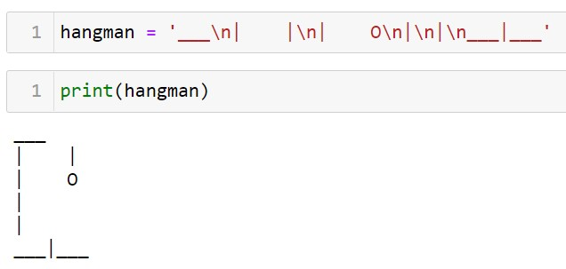

# Hangman Game
The hangman game consists on trying to guess a secret word before our porr man dies. The PC will choose a random word from a list of words that can be modified changing the variable words.
## List of Words
It can be modified using the variable words.

## Creating a hangman
The first thing that I tried when creating a hangman was doing it with a string. However, as seen in the picture below, it can be pretty frustrating when working with so many spaces.



That's when I discovered that a comment can be assigned to a variable. This made everything much simplier.

``` python
  hangman = ['''
     ____
    |    |
    |    O
    |   /|\
    |   / \
  __|__      '''] 
```
So, to print the hangman, we will use:
 * ``` hangman[0]```: pole.
 * ``` hangman[1]```: pole + head.
 * ``` hangman[2]```: pole + head + torso.
 * ``` hangman[3]```: pole + head + torso + 1 arm.
 * ``` hangman[4]```: pole + head + torso + 2 arms.
 * ``` hangman[5]```: pole + head + torso + 2 arms + 1 leg.
 * ``` hangman[6]```: dead.

## Problems
* Installing ```pip install random-word``` to generate random words using a library. Then ```from random_word import RandomWords```. And finally, create a list ```words = r.get_random_words()```
    * Error :  ``` No module named ...```

